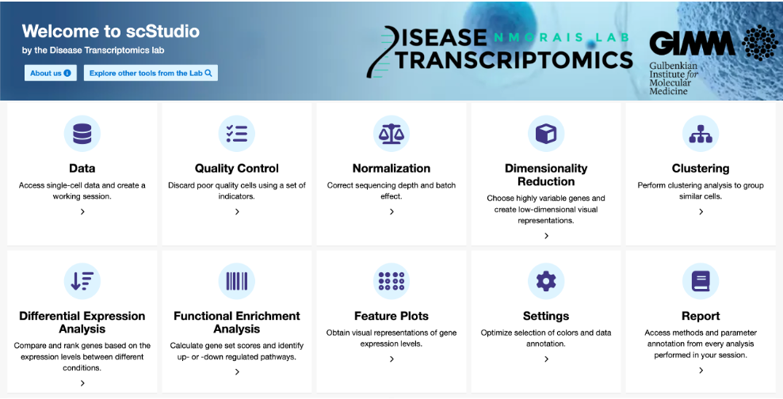
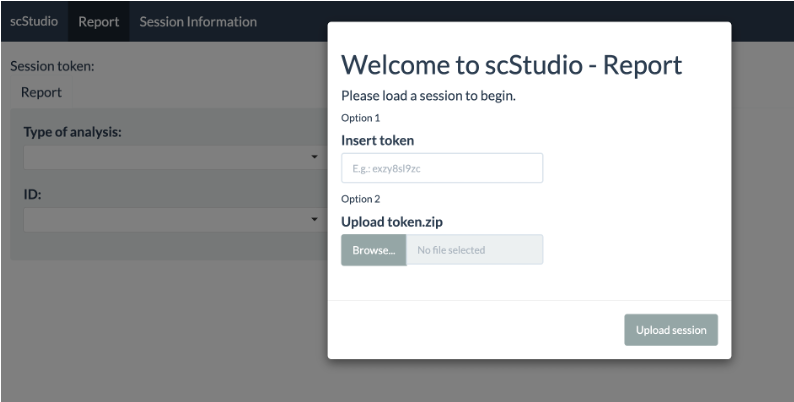
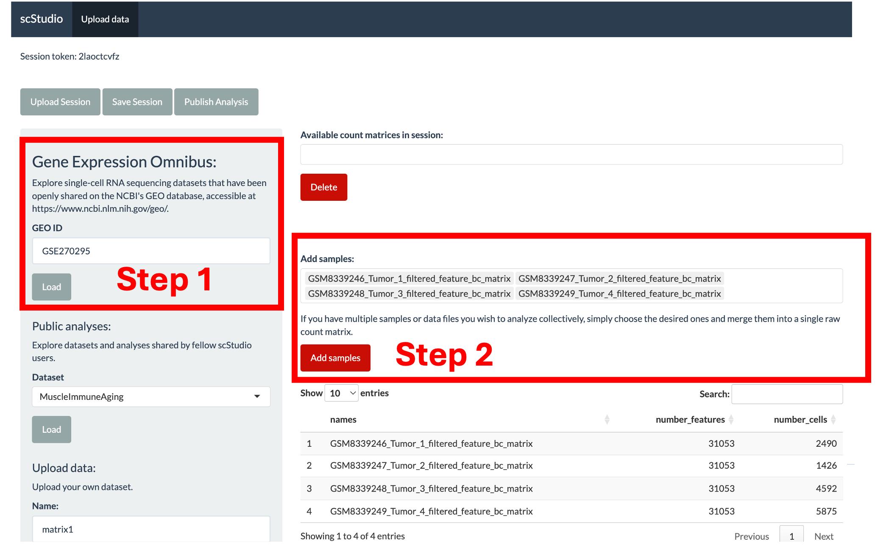
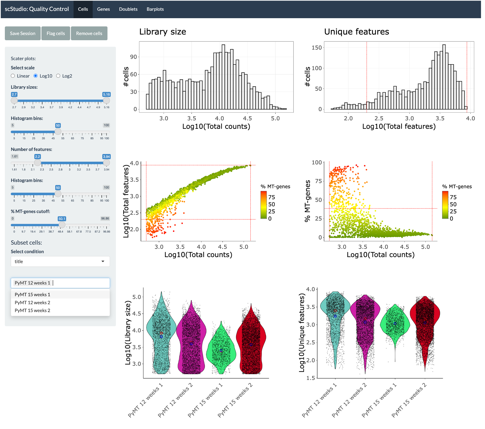
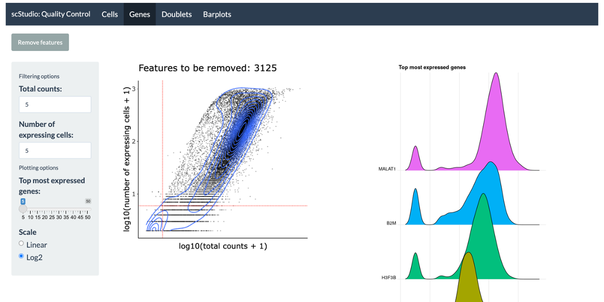
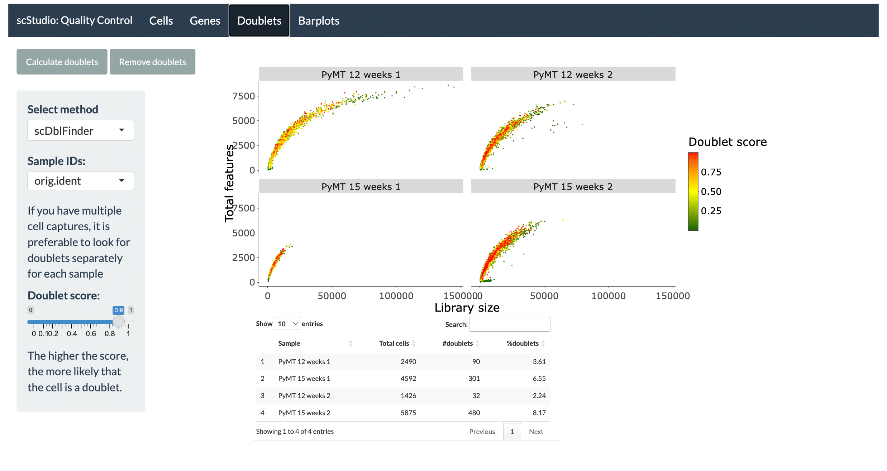
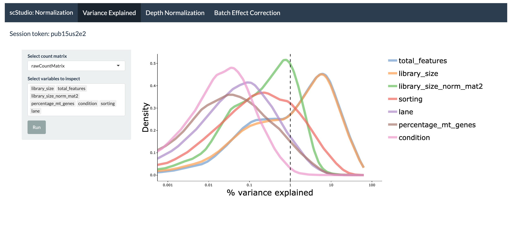
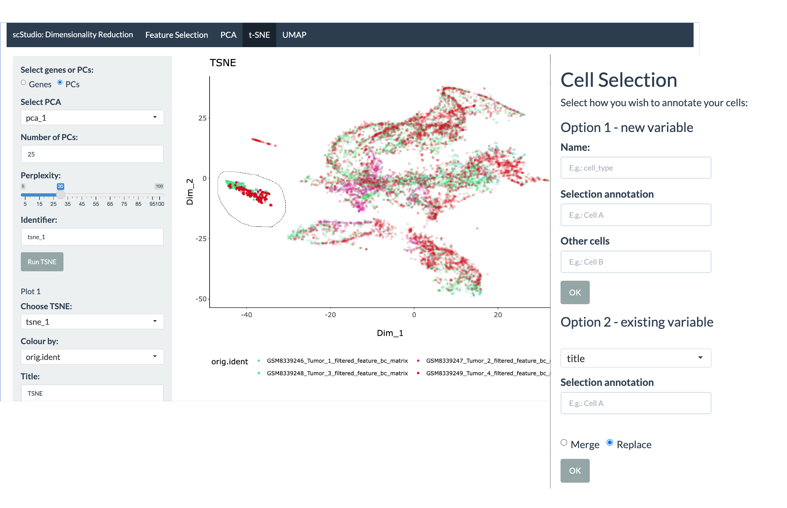

# scStudio
**A User-Friendly Web Application Empowering Non-Computational Users with Intuitive scRNA-seq Data Analysis**

**scStudio** is a user-friendly, web-based application for comprehensive and modular scRNA-seq data analysis. It supports automatic data retrieval from GEO, custom data uploads, and integration of multiple datasets. With tools for quality control, normalization, clustering, differential expression, and enrichment analysis, it offers flexibility, session tracking, and sharing features—making advanced single-cell analysis accessible to a broad range of users.

# Development

Each main analysis step is implemented as a separate Shiny app. This modular approach allows users to run multiple types of analyses simultaneously, each in its own dedicated app window. As different methods complete their computations, the results are automatically updated, ensuring that users have real-time access to their data and analyses. 

**To begin using scStudio**, start by creating a working session in the [Data interface](https://compbio.imm.medicina.ulisboa.pt/app/scStudio_DATA). This interface allows you to:

- Retrieve datasets directly from GEO

- Upload your own data in various formats

- Load public working sessions from previously processed datasets

Each session is assigned a unique token, which you can use to save and resume your analysis, share your session with others, or download your data files for local use.

**IMPORTANT:** Sessions that remain inactive for over two weeks will be automatically removed from the server. If you wish to preserve your session for a longer period, please contact: ana.bica@gimm.pt.

# Gene Expression Omnibus interface

scStudio enables the automatic retrieval of scRNA-seq data from GEO. To get started, simply enter the GEO accession ID of your dataset and click “Load.” Once the data is loaded, you can select the samples of interest and click “Add samples” to generate a unified count matrix for downstream analysis.

**Note:** Currently supported data formats include tabular files (CSV, TSV, TXT), Excel spreadsheets (XLSX), Cell Ranger Market Exchange Format (MEX) files commonly used for 10X Genomics data, and HDF5 (.h5) files.

   
# Quality control

Poor-quality cells can be filtered based on library size, number of detected features, and mitochondrial read percentage, with optional log-transformed metrics to highlight deviations. Cells can be removed or flagged, and users can explore them by metadata variables. Gene filtering is available for the removal of lowly expressed genes: 

Doublet identification and removal is supported for droplet data:

**Note:** Doublet identification should be performed prior to the removal of poor-quality cells to accurately model the doublet profile. 

# Normalization and batch effect correction
 
We recommend first inspecting the proportion of variance in your count matrix that’s explained by each known variable such as batch, sequencing depth, or other experimental factors—using a variance‑explained plot. This step helps you identify non‑biological sources of variation that should be corrected during normalization and batch effect correction.

# Feature selection and dimensionality reduction

In this tab, users are able to first identify highly variable genes (HVGs) using a modeled mean-variance trend. The top HVGs can then be employed in downstream analyses, including dimensionality reduction (PCA, t-SNE and UMAP) and clustering, to mitigate noise from lowly expressed genes and/or genes with minimal biological variance. 

Each dimensionality reduction plot enables users to manually select groups of cells and assign them to new annotation variables, which can then be used in downstream analyses such as differential gene expression analysis. 

**For more information on parameter selection, please check the publication [scStudio: A User-Friendly Web Application Empowering Non-Computational Users with Intuitive scRNA-seq Data Analysis](bioRxiv)**

