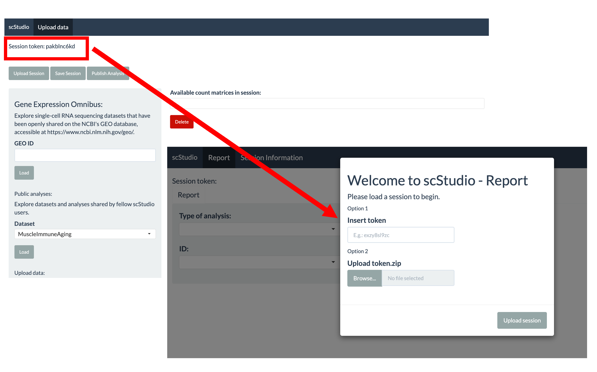
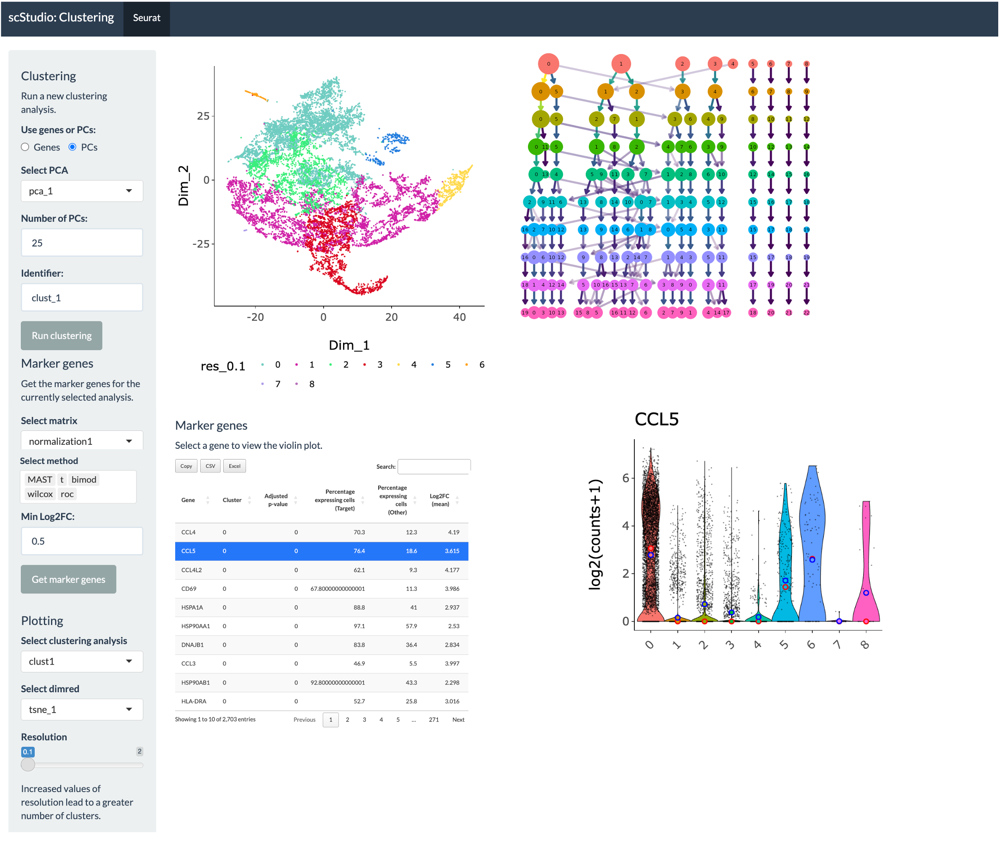
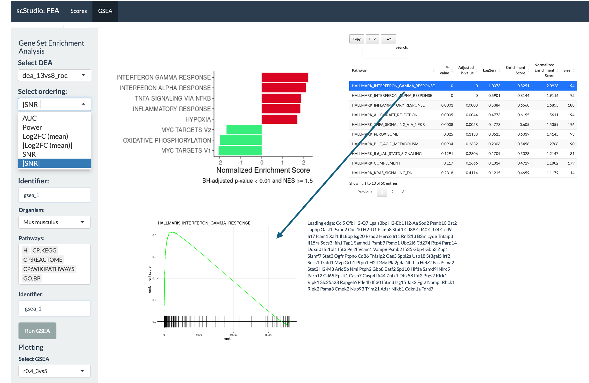
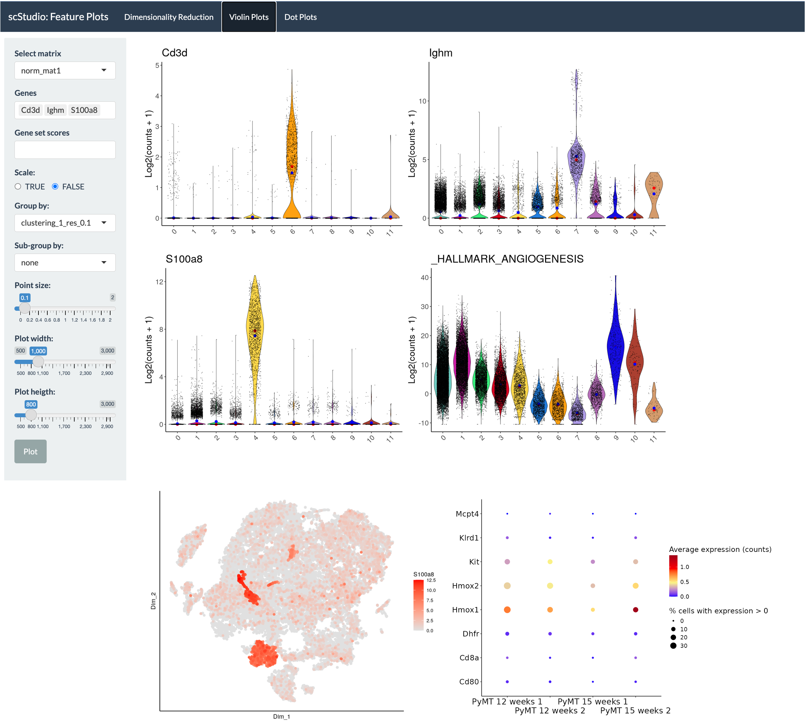
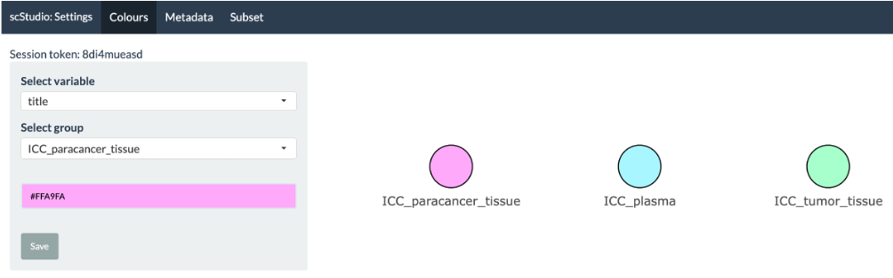
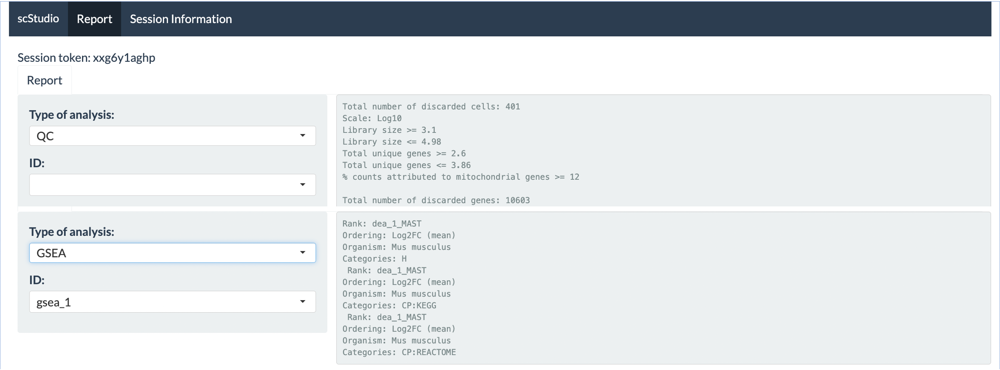

# [scStudio - Web Browser Version](https://compbio.imm.medicina.ulisboa.pt/app/scStudio)
**A User-Friendly Web Application Empowering Non-Computational Users with Intuitive scRNA-seq Data Analysis**

**scStudio** is a user-friendly, web-based application for comprehensive and modular scRNA-seq data analysis. It supports automatic data retrieval from GEO, custom data uploads, and integration of multiple datasets. With tools for quality control, normalization, clustering, differential expression, and enrichment analysis, it offers flexibility, session tracking, and sharing features—making advanced single-cell analysis accessible to a broad range of users.

## 📑 Table of Contents

- [Development](#development)
- [Gene Expression Omnibus interface](#gene-expression-omnibus-interface)
- [Quality control](#quality-control)
- [Normalization and batch effect correction](#normalization-and-batch-effect-correction)
- [Feature selection and dimensionality reduction](#feature-selection-and-dimensionality-reduction)
- [Clustering analysis](#clustering-analysis)
- [Differential expression analysis](#differential-expression-analysis)
- [Functional enrichment analysis](#functional-enrichment-analysis)
- [Feature plots](#feature-plots)
- [Settings](#settings)
- [Report](#report)
- [Running the App with Docker](#running-the-app-with-docker)

# Development

Each main analysis step is implemented as a separate Shiny app. This modular approach allows users to run multiple types of analyses simultaneously, each in its own dedicated app window. As different methods complete their computations, the results are automatically updated, ensuring that users have real-time access to their data and analyses. **[VIDEO TUTORIAL ON GETTING STARTED](link)**

[](https://compbio.imm.medicina.ulisboa.pt/app/scStudio)


**To begin using scStudio**, start by creating a working session in the [Data interface](https://compbio.imm.medicina.ulisboa.pt/app/scStudio_DATA). This interface allows you to:

- Retrieve datasets directly from GEO

- Upload your own data in various formats

- Load public working sessions from previously processed datasets

Each session is assigned a unique token, which you can use to save and resume your analysis, share your session with others, or download your data files for local use.



**IMPORTANT:** Sessions that remain inactive for over two weeks will be automatically removed from the server. If you wish to preserve your session for a longer period, please contact: ana.bica@gimm.pt.

# Gene Expression Omnibus interface

scStudio enables the automatic retrieval of scRNA-seq data from GEO. To get started, simply enter the GEO accession ID of your dataset and click “Load.” Once the data is loaded, you can select the samples of interest and click “Add samples” to generate a unified count matrix for downstream analysis.

**Note:** Currently supported data formats include tabular files (CSV, TSV, TXT), Excel spreadsheets (XLSX), Cell Ranger Market Exchange Format (MEX) files commonly used for 10X Genomics data, and HDF5 (.h5) files.


   
# Quality control


Poor-quality cells can be filtered based on library size, number of detected features, and mitochondrial read percentage, with optional log-transformed metrics to highlight deviations. Cells can be removed or flagged, and users can explore them by metadata variables. Gene filtering is available for the removal of lowly expressed genes: 


Doublet identification and removal is supported for droplet data:


**Note:** Doublet identification should be performed prior to the removal of poor-quality cells to accurately model the doublet profile. 

# Normalization and batch effect correction
 
We recommend first inspecting the proportion of variance in your count matrix that’s explained by each known variable such as batch, sequencing depth, or other experimental factors—using a variance‑explained plot. This step helps you identify non‑biological sources of variation that should be corrected during normalization and batch effect correction.


# Feature selection and dimensionality reduction

In this tab, users are able to first identify highly variable genes (HVGs) using a modeled mean-variance trend. The top HVGs can then be employed in downstream analyses, including dimensionality reduction (PCA, t-SNE and UMAP) and clustering, to mitigate noise from lowly expressed genes and/or genes with minimal biological variance. 

Each dimensionality reduction plot enables users to manually select groups of cells and assign them to new annotation variables, which can then be used in downstream analyses such as differential gene expression analysis. 


# Clustering analysis 

Users can perform clustering on either the raw count matrix or PCA-reduced space, with customizable parameters like feature selection and number of principal components. A clustering tree is generated to visualize results. Marker genes for each cluster can be identified through differential expression analysis, with user-defined thresholds (e.g., log fold-change) to filter results and improve performance. Several statistical methods are available, including Wilcoxon Rank Sum, likelihood-ratio test, ROC analysis, Student’s t-test, and MAST, enabling benchmarking across approaches. 



# Differential expression analysis

Users can select any combination of available cell annotations for comparison, including the union or intersection of different conditions, allowing for more flexible and customized analyses.


# Functional enrichment analysis 

We currently provide two methods for functional enrichment analysis (FEA), gene set scoring and Gene Set Enrichment Analysis (GSEA). Gene set scores are calculated as the sum of the normalized (log2 median-centered) expression levels of the genes in each user-selected gene set. Users can choose from gene sets included in the [MSigDB Collections] (https://www.gsea-msigdb.org/gsea/msigdb/index.jsp) or define custom gene sets for analysis. GSEA is performed using the fgsea function from the fgsea package (version 1.20.0).




# Feature plots

This tab offers multiple tools for exploring gene expression data. Users can view violin plots of selected marker genes in a grid layout, with the option to group data by specific variables. Dimensionality reduction plots can be colored by gene expression levels, making it easy to identify patterns of gene activity. A dot plot is also available to compare average gene expression across groups. These visualization options are equally available for gene set scores.



# Settings

In this tab, users can perform 3 main tasks: 
- Assign custom colours to cell groups to simplify plot visualization and maintain consistent color references for future analyses and publications;
- Customize cell annotations by editing existing variable names, creating new metadata fields, or incorporating clustering labels into the dataset’s metadata;
- Subset the cells in the dataset to create a new session and continue the analysis on the selected population.



# Report 

For each analysis method, scStudio maintains a report documenting the parameters used. This feature ensures that all steps of the analysis are recorded, allowing users to review and track the settings and choices made during the process.




**For more information on parameter selection, please check the publication [scStudio: A User-Friendly Web Application Empowering Non-Computational Users with Intuitive scRNA-seq Data Analysis](bioRxiv)**

# Running the App with Docker

Each scStudio module is packaged as a standalone Docker image and can be executed independently on a local machine by following these steps:

1. Ensure you have Docker installed on your machine. If not, you can download and install Docker from [here](https://www.docker.com/get-started).

2. Pull the Docker image of the module that you would like to run. [Available images can be found here](  https://hub.docker.com/repositories/martabica). For example, to start deploying the Data tab:  
   ```bash
   docker pull martabica/scstudio-selectdata:1.1
   ```

3. Run the app with the following command:
   ```bash
   docker run -p 3838:3838 -v [local/path/to/token/storage]:/home/app/tokens martabica/scstudio-selectdata:1.1
   ```
4. Access the app in your browser at [http://0.0.0.0:3838](http://0.0.0.0:3838).   

Please note that public datasets are not included within the Docker image. However, you can create a session using the browser-based version of scStudio with public data, then download the corresponding token folder and place it in your local tokens directory to use it with the Docker version.  


